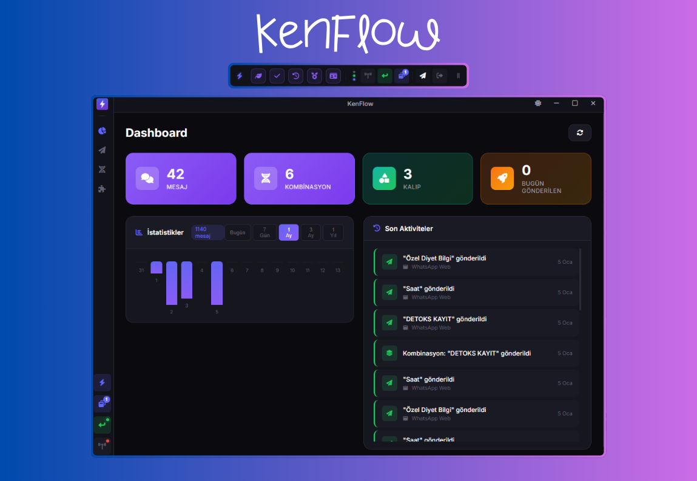

<div align="center">



# KenFlow

**Akıllı Mesaj Otomasyonu için Masaüstü Uygulaması**

Tekrarlayan mesajları otomatikleştirin, müşteri iletişiminizi hızlandırın.

[](LICENSE.txt)
[](https://github.com/Kenfrozz/KenFlow/releases)
[](https://github.com/Kenfrozz/KenFlow/releases)

[İndir](https://github.com/kenfrozz/kenflow/releases)

</div>

---

## Genel Bakış

**KenFlow**, işletmelerin müşteri iletişiminde harcadığı zamanı azaltmak için tasarlanmış modern bir masaüstü uygulamasıdır. Klavye kısayolları ile tek tuşta mesaj gönderimi, kalıp sistemi ile her seferinde farklı ve doğal mesajlar, overlay modu ile kesintisiz iş akışı sunar.

## ✨ Özellikler

- **⚡ Hızlı Mesaj Gönderimi** - Klavye kısayolları ile tek tuşta mesaj gönderin
- **🎯 Kalıp Sistemi** - Dinamik içerik ile her mesajı farklılaştırın ve insansı hale getirin
- **🎨 Overlay Modu** - Ekranın üzerinde minimal, yüzen arayüz
- **🎪 Akıllı Hedefleme** - Mesajları sadece belirlediğiniz uygulamalarda çalıştırın
- **🔗 Kombinasyonlar** - Birden fazla mesajı zincirleme gönderin
- **📊 İstatistikler** - Gönderilen mesajları ve kullanım alışkanlıklarınızı takip edin

## 📥 İndir

En son sürümü [Releases](https://github.com/Kenfrozz/KenFlow/releases) sayfasından indirebilirsiniz.

**Mevcut Sürüm:** `v1.0.4`

- `KenFlow-1.0.4-Setup.exe` - Installer (Önerilen)
- `KenFlow-1.0.4-Portable.exe` - Portable Versiyon

## 🚀 Kurulum

### Kullanıcılar

1. [Releases](https://github.com/Kenfrozz/KenFlow/releases) sayfasından `KenFlow-Setup.exe` dosyasını indirin
2. İndirilen dosyayı çalıştırın
3. Kurulum adımlarını takip edin
4. Uygulamayı başlatın ve ilk mesajınızı oluşturun

### Geliştiriciler

```bash
# Projeyi klonlayın
git clone https://github.com/Kenfrozz/KenFlow.git
cd kenflow-app

# Bağımlılıkları yükleyin
npm install
pip install -r python/requirements.txt

# Uygulamayı başlatın
npm start
```

**Gereksinimler:**

- Windows 10/11 (64-bit)
- Node.js 16+ (geliştirme için)
- Python 3.8+ (geliştirme için)

## 💡 Kullanım

### Temel Kullanım

1. **Mesaj Oluştur**: Ana ekrandan "Yeni Mesaj" butonuna tıklayın
2. **İçerik Ekle**: Mesaj içeriğini yazın ve bir hotkey atayın (örn: `Ctrl+1`)
3. **Gönder**: İstediğiniz uygulamada hotkeyinizi kullanın

### Kalıp Sistemi

Mesajlarınızda dinamik içerik için kalıplar kullanın:

```
Merhaba! Siparişiniz {durum} {emoji}
```

**Kalıp Tanımlama:**

- `durum`: hazırlanıyor, kargoya verildi, teslim edildi
- `emoji`: ✅, 📦, 🚀

Her gönderimde rastgele kombinasyon seçilir ve doğal, insansı mesajlar oluşturulur.

### Overlay Modu

Ekranın üzerinde minimal arayüz ile kesintisiz çalışın:

1. Ayarlar menüsünden Overlay Modu'nu aktifleştirin
2. Global kısayol ile overlay'i açın
3. Mesajları klavye ile gönderin
4. Overlay'i istediğiniz konuma sürükleyin

## 📄 Lisans

Bu proje MIT Lisansı ile lisanslanmıştır. Detaylar için [LICENSE](LICENSE.txt) dosyasına bakın.

## 📞 Destek

Sorular, öneriler veya hata bildirimleri için:

- [GitHub Issues](https://github.com/Kenfrozz/KenFlow/issues)

---

<div align="center">

**KenFlow** © 2026 | Made with 💜 for businesses

</div>
